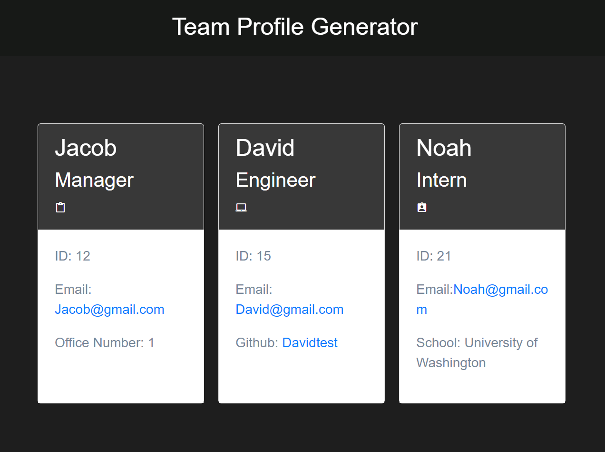

# NodeJSCardGenerator

  
  
## Description
This is was 10th challenge in coding bootcamp journey.  For this challenge, we had to follow acceptance criteria to generate an HTML file that contains information from user input. This project uses the Inquirer package for user prompts and Jest for testing. Bootstrap was used for the HTML cards and CSS styling.
  
## Table of Contents
* [Description](#description)
* [Installation](#installation)
* [Usage](#usage)
* [Questions](#questions)
  
## Installation
* ``git clone`` the repository
* Open a Node terminal and run the command ``npm install`` to install required packages
* Run the command ``node index.js`` to initiate the card generator
* Your ``test.html`` file should be created after all prompts are filled out
  
## Usage
You can view a walkthrough video of the application [here](https://raw.githubusercontent.com/Noahbrown26/NodeJSCardGenerator/main/assets/demo.mp4)

  
## Questions
Any Questions? Please reachout to me at Noahbrown2663@gmail.com
In addition, you can view this project and others on my [GitHub](https://github.com/Noahbrown26)
